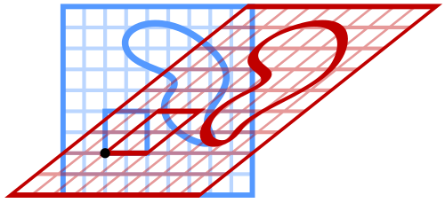

# Holbein and Linear Transformations

**Tags:**
Linear Algebra
Python

## A linear algebra background

Throughout my first year of college, specifically in my **Linear Algebra** class (in romanian, **Algebră liniară, geometrie analitică si ecuații diferențiale**), we studied the concept of **linear tranformations** and their real world applications.

Mathematically, we saw that any matrix **$A \in \mathcal{M}_{m,n}(\mathbb{R})$** defines a linear transformation **$f : \mathbb{R}^n \to \mathbb{R}^m$**, given by **$f(x) = Ax$**. One such linear transformation is the **shear transformation**, which has the 2 following matrix definitions: **$\begin{pmatrix} 1 & a\\ 0 & 1 \end{pmatrix}$** or **$\begin{pmatrix} 1 & 0\\ a & 1 \end{pmatrix}$**, **$a \in \mathbb{R} $**. 

Why would this be usefull? Visually, a shear transform can be used to _warp_ a domain, and as such, change the appearance of an image. For example, let's consider the **horizontal sheer transform**:

